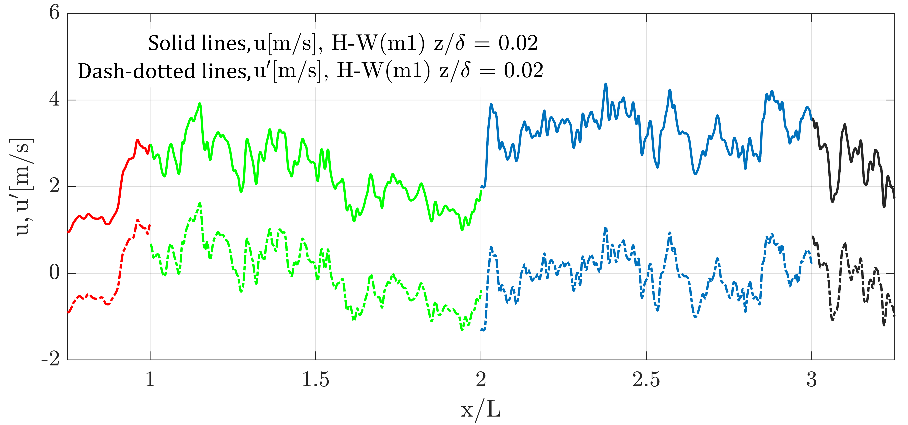
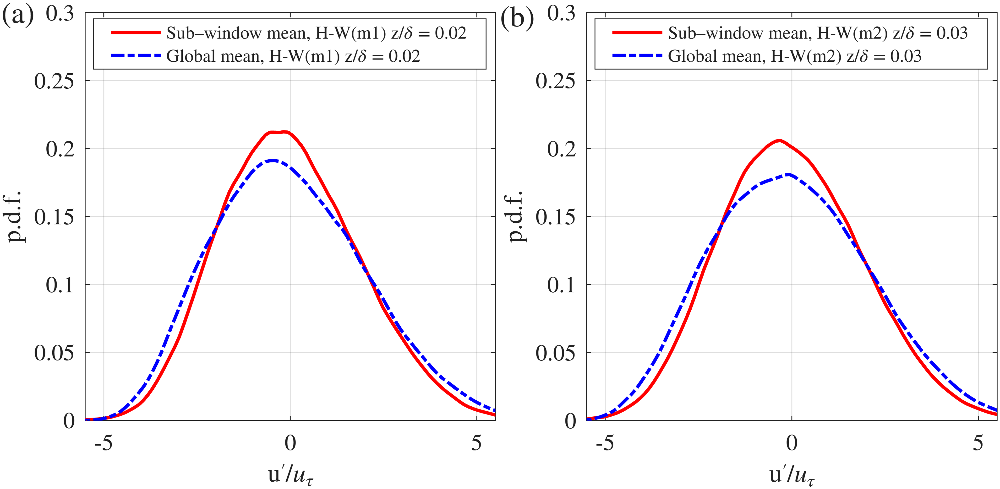

# Bayesian-Stochastic generation of (spatio/temporal)-series signal

Tool to stochastically generate (spatio/temporal)-series velocity signal. This velocity signal can be used in stochastic generation of turbulent boundary layer velocity field.

## Contents
- [python package](#python-package)
- [Algorithm](#algorithm)

## Python package
<!-- brief blurb or link to docs/install/usage -->
<details>
<summary> Installation:</summary>

1. 🛠️ Installing Poetry

To install [Poetry](https://python-poetry.org/) (Python dependency management and packaging tool), run the following command in your terminal:

```bash
curl -sSL https://install.python-poetry.org | python3 -
```

After installation, make sure Poetry is in your `PATH`
- macOS/Linux
```bash
export PATH="$HOME/.local/bin:$PATH
```

Verify installation:

```bash
poetry version
```

Keep venv inside the project (works great with VS Code) poetry 

```bash
config virtualenvs.in-project true
```

2. Installing environment: 

This environment is set with Python 3.13. Change the requires-python = ">=3.13" in pyproject.tmol file if you have other versions on your PC.

run:
```bash
poetry install
```

In case if you want to make environment from scratch, run:(Do not recommended)

```bash
poetry new project_name
```
If you want to delete the caches use:
```bash
git rm -r --cached .
```

Then re download the .git file and do:
```bash
git add .
git commit -m 'init'
git push
```
</details>

<details>
  <summary>Click to see the documentation for Python files</summary>

### Python files
`Bayesian_ST/src/bayesian_st`<br>
- `main.py:` Define the parameters.<br>


`Bayesian_ST/src/bayesian_st/utils`<br>
- `Stochastic_generation.py:` Defining object.<br>
- `Short_time_analysis.m:` Chope signal into the desired length. For this file, you need experimental dataset, which I have used Hotwire time resolved dataset ([Link])(https://conservancy.umn.edu/items/e2f507c9-570d-46b6-b70c-939877caf668). Fig1 and Fig2 can be generated using this file. There is no need to run this file, just use the output vectors, which are standard deviation of fluctuating velocity signal (u^{\prime}/u_{\tau}, w^{\prime}/u_{\tau}) of the chopped time-series velocity signal (,std_uprime_chopped.mat,std_wprime_chopped.mat). At the end of this file, we only use the results of the standard deviation of the chopped HotWT7. To justify our claim, I did hypothesis testing. $H_{0}:$ the difference between standard deviation is MORE than our margin $\delta$ (Not Favorable). $H_{a}:$ the difference between standard deviation is LESS than our margin $\delta$ (Favorable). I tried to reject the null hypothesis with confidence interval of 90% (significance level $\alpha=0.05$). Since we do not know about the distribution, I used non-parametric approach to test the hypothesis (Bootstraping). <br>
$$H_{0}: |\sigma_{choppedWT7} - \sigma_{choppedWT10}| > \delta$$

$$H_{a}: |\sigma_{choppedWT7} - \sigma_{choppedWT10}| <= \delta$$


Now, to test out alternative hypothesis, we can either use CI or P-value. If CI be in the range of ($-\delta,\delta$), we can reject the null hypothesis. For P-value, we always use the assumption of NULL HYPOTHESIS. If p-val be less than alpha, which shows the probability of occurrence of null hypothesis based on the distribution, which is always our criteria, is low-> So we can reject the $H_{0}$.<br>

$$p_1 = \Pr(d_{boot} \le -\delta) \approx \frac{1}{B} \sum_{b=1}^{B} \mathbf{1}\{\,d_b \le -\delta\,\}$$

$$p_2 = \Pr(d_{boot} \ge \delta) \approx \frac{1}{B} \sum_{b=1}^{B} \mathbf{1}\{\,d_b \ge \delta\,\}$$

If $p_1<\alpha \\;\\&\\; p_2<\alpha$ we reject the $H_{0}$.<br>

- `defferential_analysis_chopped.m:` To generate the spatio/temporal velocity signal, we need joint distribution of extremums (Local min, Local max) points (Fig4). Furthermore, we need the joint distribution of the gradient of each time series sample point w.r.t. next point sample and the minimum distance to the local extremums (Fig5). The conditional distribution is shown in Fig6.


- `MDN.ipynb:` In this jupyter notebook file, I started reproducing the result of the [Mixture Density Network](https://publications.aston.ac.uk/id/eprint/373/1/NCRG_94_004.pdf) algorithm. Then generated samples with exponential distribution and use MDN to fit the samples. This exercise was done to see the performance of the model on the exponentially distributed sample. Since gradient of sample points w.r.t. next neighboring sample point (Fig6.) has exponential distribution. Then in the following, I read the samples exported from `defferential_analysis_chopped.m` and `Short_time_analysis.m` and used MDN model to fit to the distribution.

- `velocity_flu_gen.py:`


</details>

## Algorithm
Fig 1: The velocity signal is chopped into the desired length scale.<br>

<br>
Fig 2: Variability of the velocity signal after chopping for different datasets.<br>

<br>
Fig 3: Shows the algorithm of generating velocity signal.<br>

<br>
Fig 4: Joint distribution of the local extremums for different dataset.<br>

<br>
Fig 5: Joint distibution of minimum distance of each time series sample to the local extremums and gradient to the next sample.<br>

<br>
Fig 6: (a)conditional sampling given local extremums. (b)conditional sampling given minimum distance to the local extremums.<br>

<br>